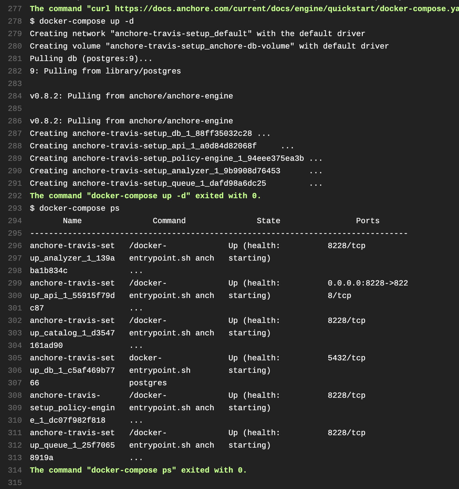
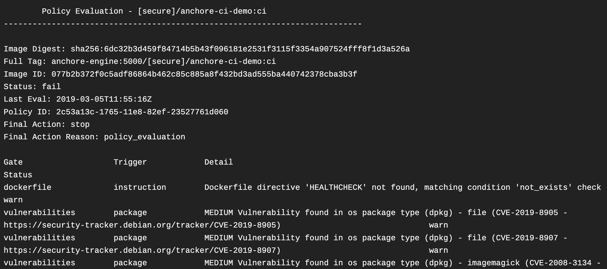

# Travis CI Pipelines: Anchore


The Anchore Engine is an open-source project that provides a centralized service for inspection, analysis, and certification of container images. The Anchore Engine is provided as a Docker container image that can be run standalone or within an orchestration platform such as Kubernetes, Docker Swarm, Rancher, Amazon ECS, and other container orchestration platforms.

Anchore Engine can be used in several ways:

* Standalone or interactively.
* As a service integrated with your CI/CD to bring security/compliance/best-practice enforcement to your build pipeline.
* As a component integrated into existing container monitoring and control frameworks via integration with its RESTful API.

## Implementing Anchore into your project via the `.travis.yml` file to check your containers 

First, let's take a look at your `.travis.yml` file: 

```yaml
---
sudo: required
dist: bionic
notifications:
  slack:
    on_failure: always
matrix:
  fast_finish: true
  include:

    # https://github.com/anchore/anchore-engine
    # https://docs.anchore.com/current/docs/engine/quickstart/
    - name: "Scan images w Anchore Engine w docker-compose wo snaps on bionic amd64"
      dist: bionic
      arch: amd64
      services:
        - docker      
      language: python
```

As you can see above, you're off to a good start, you have your `dist`, `sudo` specified, `matrix` specified with a `job` name. The job will be running `bionic`, the architecture will be `amd64` and of course Anchore is going to be checking the Docker container via `docker-compose`, and the way this will happen is once Anchore is fetched and `docker-compose ps` is ran, it will show the status of the container. Let's finish the `.travis.yml` file. We'll want to start with the `before_install` hook that Travis offers. 

```yaml
 before_install:
        - pip3 install virtualenv
        - virtualenv -p $(which python3) ~venvpy3
        - source ~venvpy3/bin/activate
        - pip install -r requirements.txt
      script:
        #  Download the docker-compose.yaml file and start
        - curl https://docs.anchore.com/current/docs/engine/quickstart/docker-compose.yaml > docker-compose.yaml
        - docker-compose up -d
        # Verify service availability
        - docker-compose ps
      after_success:
        - deactivate        
```
You'll see the `script` hook using `cURL` to fetch Anchore, then copying the `docker-compose.yaml` file. It then makes sure the container is up by running `docker-compose up -d`. Now you'll want to verify service, the `.travis.yml` file will run `docker-compose ps`. Then of course, after it's done it will deactivate itself. This is Anchore in a simple `.travis.yml` file. You should see the Anchore table with it's findings at the end of your build as follows: 



## Further setup 

Travis allows `docker` command execution by default, which makes integrating Anchore Engine as simple as adding the `inline_scan` script to your existing image build pipeline.

```yaml
services:
  - docker

env:
  - IMAGE_NAME="btodhunter/anchore-ci-demo" IMAGE_TAG="travisci"

script:
  - docker build -t "${IMAGE_NAME}:ci" .
  - curl -s https://ci-tools.anchore.io/inline_scan-v0.6.0 | bash -s -- "${IMAGE_NAME}:ci"
  - echo "$DOCKER_PASS" | docker login -u "$DOCKER_USER" --password-stdin
  - docker tag "${IMAGE_NAME}:ci" "${IMAGE_NAME}:${IMAGE_TAG}"
  - docker push "${IMAGE_NAME}:${IMAGE_TAG}"
```

Alternatively you can setup `cURL` to fetch Anchore like this: 

```yaml
- curl https://docs.anchore.com/current/docs/engine/quickstart/docker-compose.yaml > docker-compose.yaml
```

## Anchore Policy Enforcement

It's fairly easy with Travis and Anchore to setup Anchore Policy Enforcement. You can setup policy enforcement with one command:

```bash
 curl -s https://ci-tools.anchore.io/inline_scan-v0.6.0 | bash -s -- [options] IMAGE_NAME(s)
```

These are the scan options Anchore offers:

```bash
-b  [optional] Path to local Anchore policy bundle.
-d  [optional] Path to local Dockerfile.
-v  [optional] Path to directory to be mounted as docker volume. All image archives in directory will be scanned.
-f  [optional] Exit script upon failed Anchore policy evaluation.
-p  [optional] Pull remote docker images.
-r  [optional] Generate analysis reports in your current working directory.
-t  [optional] Specify timeout for image scanning in seconds (defaults to 300s).
```

What you read above bodes well for you. With Anchore, you essentially can scan local images before pushing them into a registry, allowing you to inject scans as needed directly into your current workflows and enforce Anchore policy. You can see your policies being checked, look for the following: 



If you look above, you can see the policies being enforced, scanned, and more. I recommend looking at the `scan options` that were laid out earlier for more verbose and customized options. 
